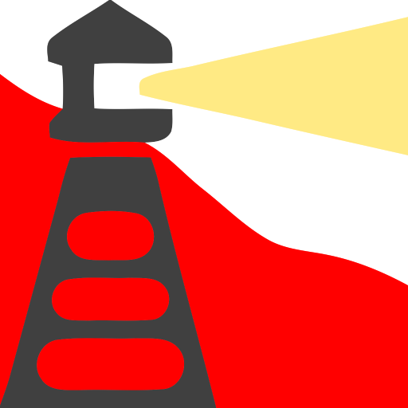

<h1> API-Killer-Beacon</h1>

<h2>Beacon/Ping HEADSHOT!</h2>

this extension blocks beacon/ping requests,  
the client-side will erase the method to send the request,
and the extension-side will block every ping-request that came-through.

I've wrote this since uBlock-origin has an issue with beacon/ping blocking,  
and the <code>*$beacon</code> rule I've used in one of my-lists,  
was blocking download-requests (either browser initiated or the kind you've right click and choose "save-as"),  
I think it was because those requests are marked as "other" (I belive since the browser overrides the mimetype to <code>application/octet-stream</code> internally to force download instead of opening for view...),  
and the request-type "other" triggers the rule-blocking too.

<pre>
Developer's HUB / Changelog

1.0.0.7
* faster JavaScript-injection by storing the SRC of the api_killer_beacon as string before usage.

1.0.0.6
* slight engine modifications.

1.0.0.5
* holding element-query multi-line string without the use of multiline method.

1.0.0.4
* improving cross-browser-API compatibility.

1.0.0.3
+ initial.
</pre>
