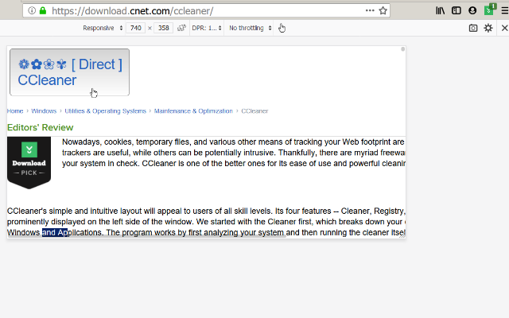

<h1> Direct-CNET</h1>

<h2>Download files directly, skip downloading the <em>CNET Download-Manager</em>, ads, redirects and skip all waiting screens.</h2>

You can even disable JavaScript and cookies through <code>chrome://settings/content/javascript</code> and <code>chrome://settings/content/cookies</code>, and get your applications-searches through Google by using <code>site:filehippo.com skype<code>,
for example: <a href="https://www.google.com/search?num=50&gbv=1&q=site%3Afilehippo.com+skype">https://www.google.com/search?num=50&gbv=1&q=site%3Afilehippo.com+skype</a>.

<h3>This Extension Is A Great Time-Saver!</h3>

<pre>
Developer's HUB / Changelog

1.0.0.5
* improving cross-browser-API compatibility.

1.0.0.4
+ initial
</pre>
