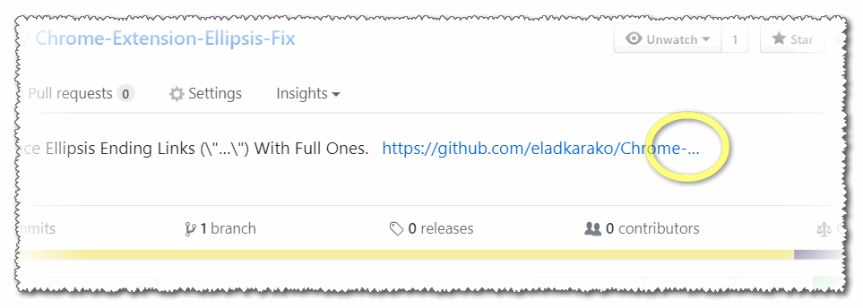
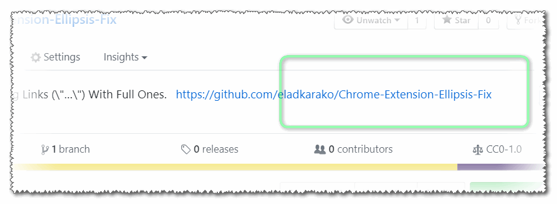

<h1> Chrome-Extension-Ellipsis-Fix</h1>

<h2>★★★★★ Replace Ellipsis Ending Links (\"…\") With Full Ones.</h2>

<pre>
Developer's HUB / Changelog

1.0.1.7
* disabling "1.0.1.4 only format a 'looks like a link' links"-check/limit since some websites include just relative URLs, but since it sits in HREF and it is in a node that has no-child nodes, it is probably safe to assign innerText.

1.0.1.6
* adding another 'end link' variation:  ..&gt; commonly used in https://nodejs.org/download/nightly/ for example
* better-escaping the regular-expression.

1.0.1.5
* improving cross-browser-API compatibility.

1.0.1.4
* only format a "looks like a link" links.
+ include '...' variation.
+ support dynamic page-content (SPF and such...).

1.0.1.2
+ initial.

</pre>

<!--  -->