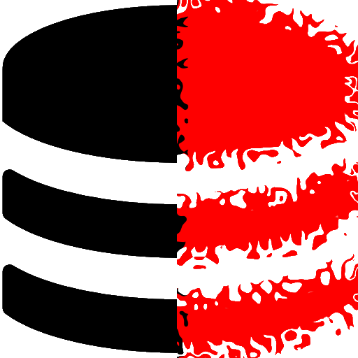

<h1> IndexedDB-Killer - &nbsp; &nbsp; </h1></h1>

Kills HTML5' <code>IndexedDB</code> API,
might break websites, if they do not have a localStorage/cookie fallback.

<pre>
Developer's HUB / Changelog

1.0.3.1
+ initial.
</pre>
