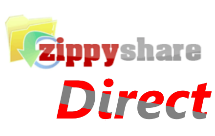

<h1> Chrome-Extension-ZippyShare-Direct &nbsp; - &nbsp; </h1>

Rewrite the download button  
with the real download-link,  
useful if you want to use ad-blocking  
and to disable JavaScript on the page.  

 

<pre>
Developer's HUB / Changelog

1.0.0.1
+ initial
</pre>
